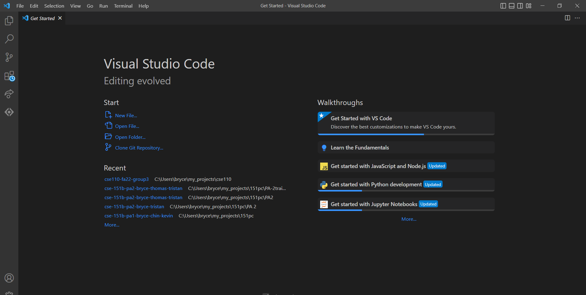
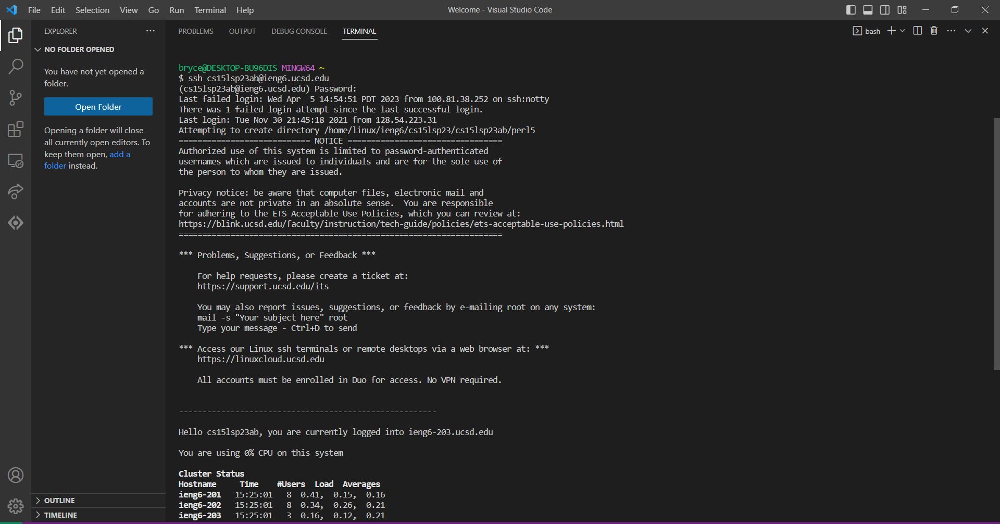
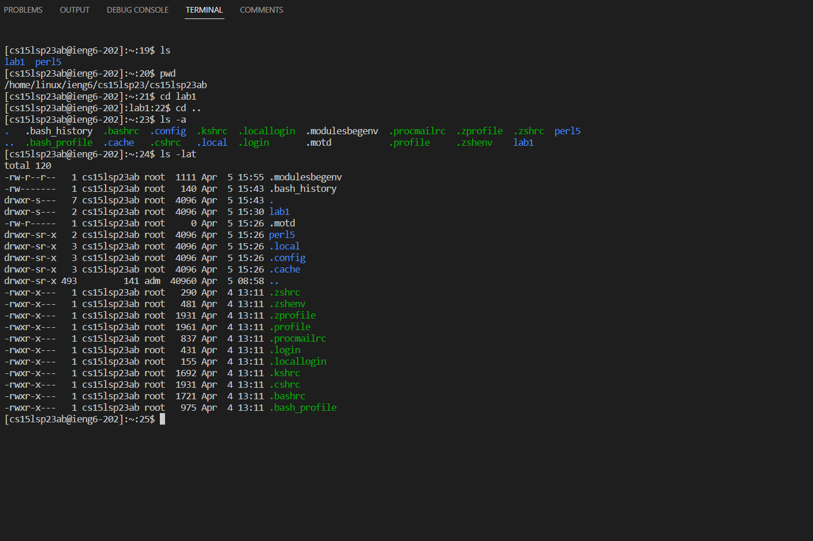

# Lab Report 1

This will act as a guide and cheat sheet for remembering how to log into a course-specific account on ieng6.

The main steps in order are:
***
- [Lab Report 1](#lab-report-1)
  - [Installing VSCODE](#installing-vscode)
  - [Remote Connection](#remote-connection)
  - [Commands](#commands)

## Installing VSCODE
First we have to download Vscode, here is the link to the download page
[VScode_Download](https://code.visualstudio.com/)

After installing Vscode and opening the application, it should look like this:

## Remote Connection

## Commands

