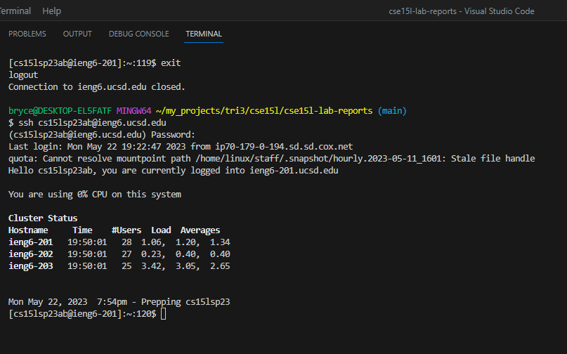
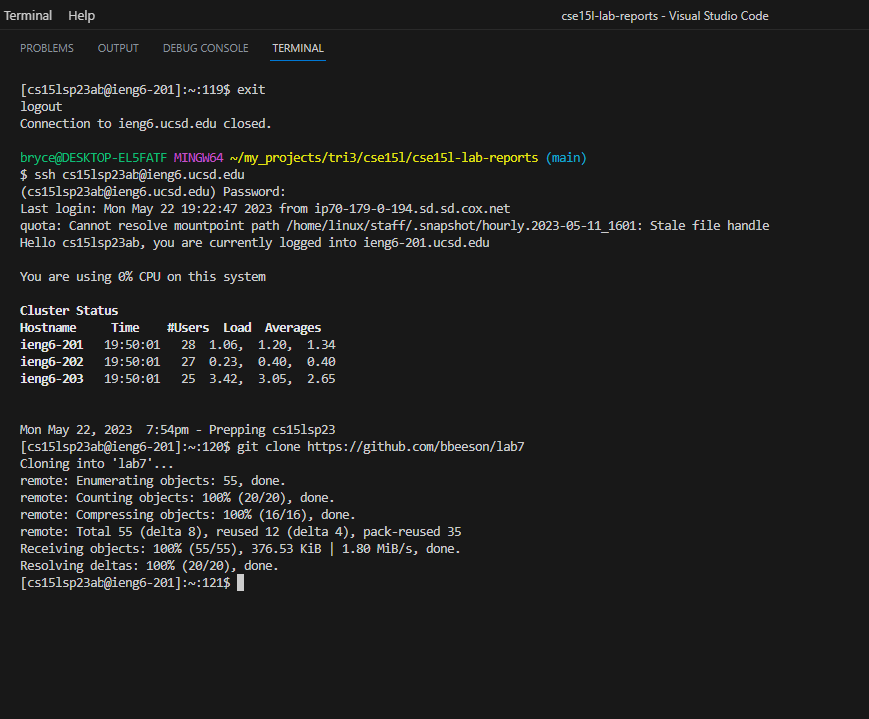
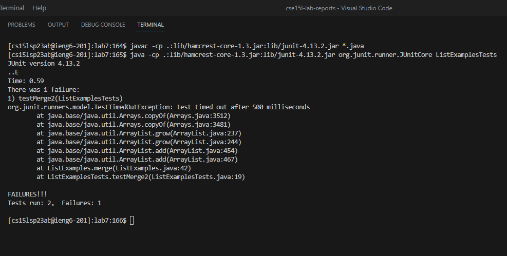
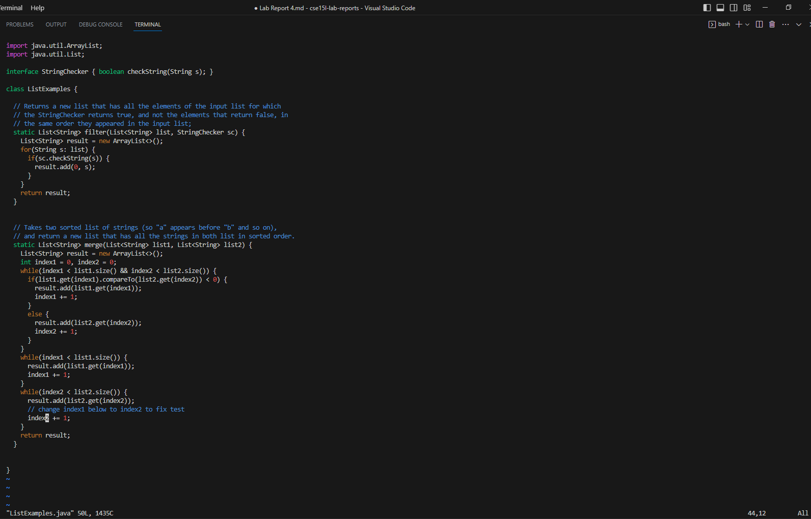
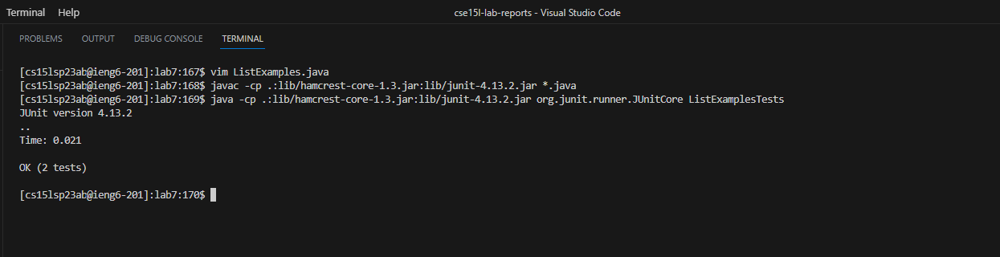
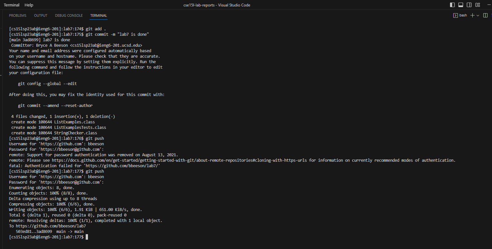
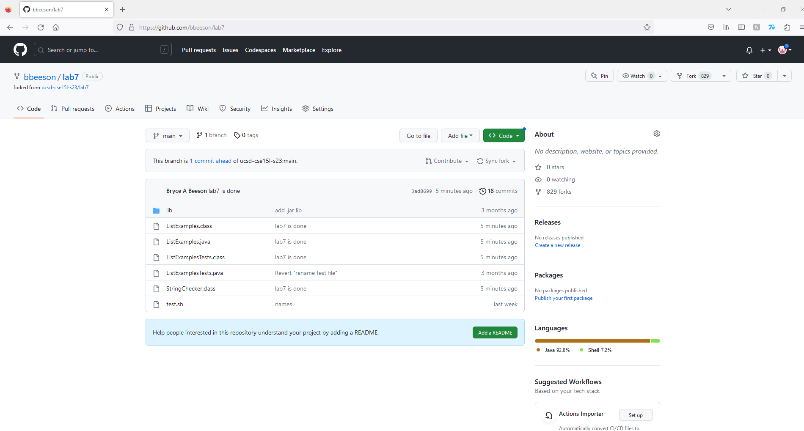

# Lab Report 4

## Log into ieng6
     

Keys Pressed: `<up>` `<enter>` then I entered my password     

Here I just had to login and the ssh command was one of my previous commands so it was right there. Then I entered my password in after that.       

## Clone your fork of the repository from your Github account
     

Keys Pressed: git clone `<crtl-c>` `<crtl-v>` `<enter>`   
(what was copied https://github.com/bbeeson/lab7)   

Here I typed git clone into the terminal then I copied and pasted the url of the repo into the terminal and hit enter.   

## Run the tests, demonstrating that they fail
   

Keys Pressed: cd lab7 `<enter>`   
              `<crtl-c>` `<crtl-v>` `<enter>` (what was copied “javac -cp .:lib/hamcrest-core-1.3.jar:lib/junit-4.13.2.jar *.java”)  
              `<crtl-c>` `<crtl-v>` `<enter>` (what was copied “java -cp .:lib/hamcrest-core-1.3.jar:lib/junit-4.13.2.jar org.junit.runner.JUnitCore ListExamplesTests”)  

Here I copied the command "javac -cp .:lib/hamcrest-core-1.3.jar:lib/junit-4.13.2.jar *.java" into the terminal and then hit enter. After that I did the same with the command “java -cp .:lib/hamcrest-core-1.3.jar:lib/junit-4.13.2.jar org.junit.runner.JUnitCore ListExamplesTests”  

## Edit the code file ListExamples.java to fix the failing test (as a reminder, the error in the code is just that index1 is used instead of index2 in the final loop in merge)
  

Keys Pressed: clear  
              vim ListExamples.java  
              `<shift-g>`   
              `<?index1>`  
              `<enter>`  
              e  
              x  
              i  
              2  
              `<esc>`  
              `<:w>`  
              `<:q!>`   
              `<enter>`    

In here I went into the file using vim and used shift to move to last line in the file. From there I use ?index1 to find the instance of index1 that I had to remove. I typed e to get to the last character of index1, hit x which removed that character, then I pressed i to enter insert mode. Finally I hit 2 which replaced the spot where 1 was. Then I pressed esc to get to normal mode and saves and quit the file.   

## Run the tests, demonstrating that they now succeed
   

Keys Pressed: clear   
             `<up><up><up><up><enter>`     
             `<up><up><up><up><enter>`     

The command for compiling and running it was 4 above so I just ran the commands “javac -cp .:lib/hamcrest-core-1.3.jar:lib/junit-4.13.2.jar *.java” and “java -cp .:lib/hamcrest-core-1.3.jar:lib/junit-4.13.2.jar org.junit.runner.JUnitCore ListExamplesTests” using this method.      

## Commit and push the resulting change to your Github account
    
    

Keys Pressed:`clear`  
             `git add .`     
             `git commit -m "lab7 is done"`   
             `git push`   
             `bbeeson`   
             `<crtl-c>` `<crtl-v>` (what was copied "Personal Access token")  

Finally I cleared the terminal to make it neater, and performed the git add to stage the changes. Then commited the files with a message and pushed these files to repo I was working from. Using my user name and a Personal Access token to use the push command.   
