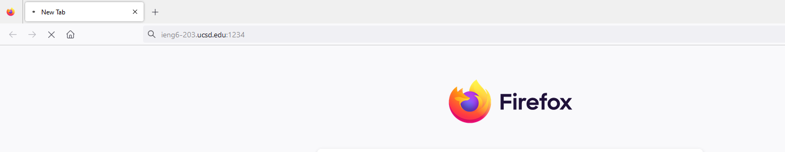
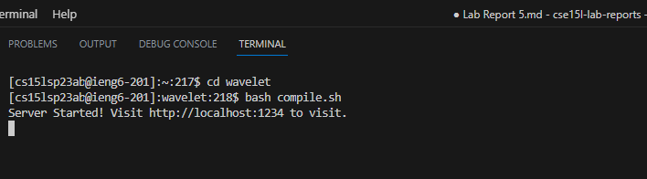
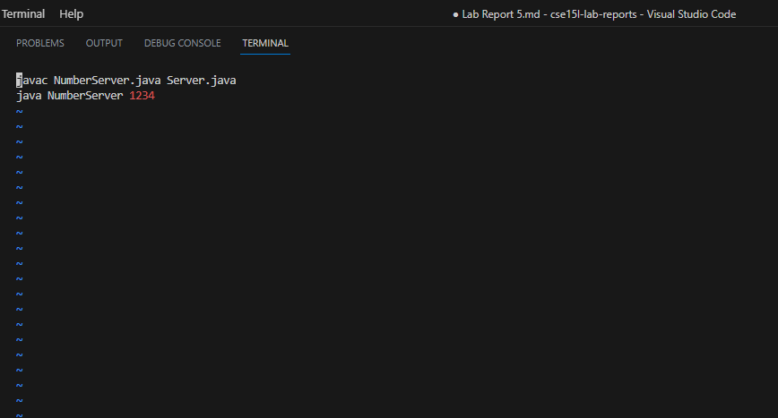
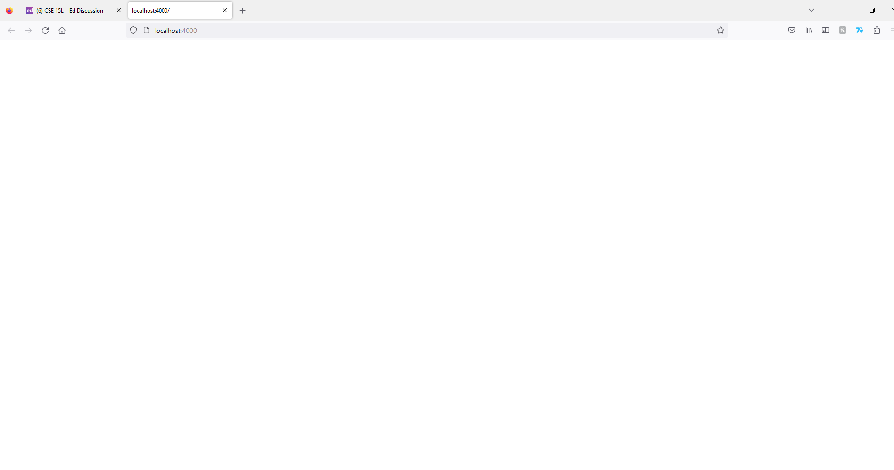
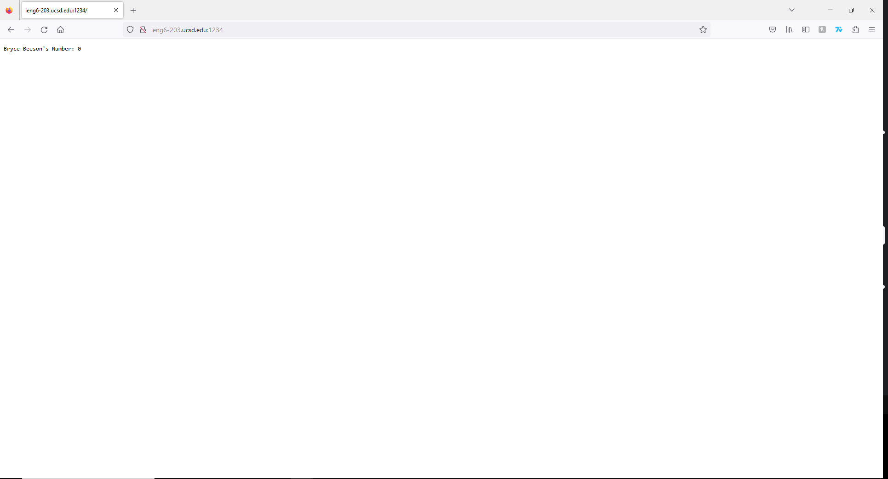

# Lab Report 5
## Part 1 – Debugging Scenario

**What environment are you using (computer, operating system, web browser, terminal/editor, and so on)?**

vscode terminal, on course specific account

**Detail the symptom you're seeing. Be specific; include both what you're seeing and what you expected to see instead. Screenshots are great, copy-pasted terminal output is also great. Avoid saying “it doesn't work”.**

I am attempting to get the server java file to work on the ieng6 accountby using a bash script. However whenever I try to connect to the webpage it just keeps buffering. 

    

Here is the webpage that just keeps buffering.

     

This is how I am using my bash script to run the commands needed for server.

    

This is the actual bash script I am using.  

As for my file and directories, I am in my ieng6 account in the wavelet directory that has the files, NumberServer.java, Server.java and compile.sh. 

**Detail the failure-inducing input and context. That might mean any or all of the command you're running, a test case, command-line arguments, working directory, even the last few commands you ran. Do your best to provide as much context as you can.**

I tried testing it out on the local host version, and it worked.
  

However I still had the same issues I was having before with my ieng6 not working. Which makes me think that it has to do with my ieng6 account since thats the main difference between the two. I am running the compile script from inside the wavelet directory so that can't be the issue, and it does not seem like the bash script is functioning incorrectly.
So my main question is what could be causing the server to not work on ieng6 but to work on local?

### TA Response

So from week 3 where we talk about accessing the ieng6 server, what are the requirements for accessing the webpage with an ieng6 server.
   

### Student Response

Ah! In week 3 we go over needing to be connected to the UCSD network in order to actually use ieng6. But it also mentions using the curl commands. With this in mind I had an idea and decided to connect to the cisco vpn and retry accessing the webpage, and I got it to work!

  

## Part 2 – Reflection

I learned a bit about bash scripts that I had forgotten or didn't learn the first time I spent time using bash so that was useful to get more experience with. I enjoyed being able to make more complicated bash scripts as a result and getting commands to work nicely together. Also using junit in bash script so I didn't have to type out the long line just showed the convience of getting more familar with bash and I am glad I got to do that this quarter.